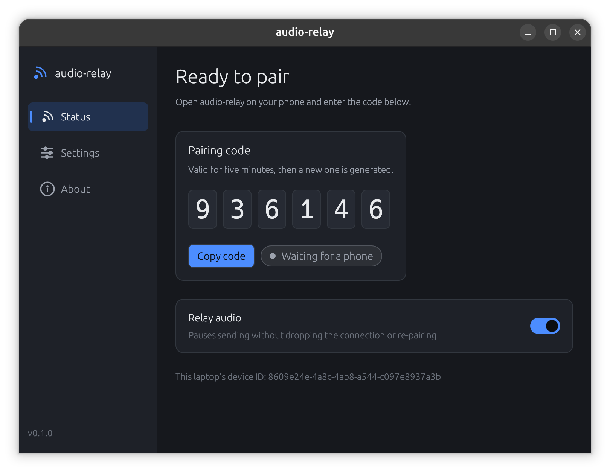
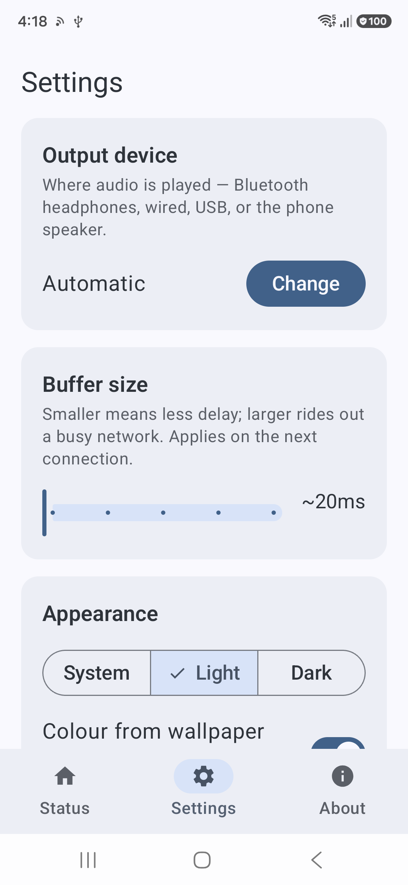
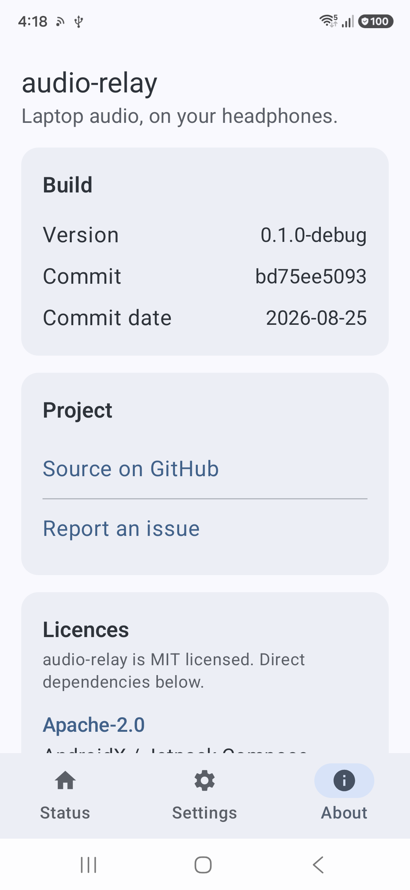

# audio-relay

Low-latency desktop → Android audio relay, played back through whatever
Bluetooth device your phone already has connected. The desktop side runs on
Windows (WASAPI loopback capture) or Linux (PulseAudio/PipeWire monitor
capture).

Because the laptop keeps playing while it relays, a pair of headphones on
the laptop and another on the phone both hear the same audio — shared
listening with nothing to set up. See the
[user guide](docs/user-guide.md#listening-on-two-headsets-at-once).

No admin rights. No virtual audio driver. No cloud service. Your phone stays
the Bluetooth endpoint — this project just gets your laptop's audio to it
over the local network (Wi-Fi or the phone's own hotspot) so Android's normal
audio routing can send it on to your earbuds/speaker exactly like it would
for Spotify.

```
Laptop (Windows/Linux)                    Phone (Android)
┌─────────────────────────┐               ┌───────────────────────────┐
│ Loopback capture         │   UDP (PCM)   │ UDP receiver → jitter buf │
│  → framer/sequencer      │──────────────▶│  → AudioTrack (USAGE_MEDIA)│
│ TCP control (pairing,    │◀─────────────▶│  → routed to your BT      │
│  heartbeat, reconnect)   │   TCP + mDNS  │    device by Android       │
└─────────────────────────┘               └───────────────────────────┘
```

## Screenshots

|  |  |  |
|---|---|---|
|  |  |  |
| Desktop — ready to pair | Desktop — streaming | Desktop — settings |
|  |  |  |
| Android — Home | Android — Settings | Android — About |

More in the [user guide](docs/user-guide.md).

## Status

Early, active development. `v0.1.0` is the first end-to-end feature set —
see [`CHANGELOG.md`](CHANGELOG.md) for exactly what it includes and
[`docs/roadmap.md`](docs/roadmap.md) for the phased build plan and what's
still ahead. Several hardware-dependent assumptions (WASAPI on real
Windows, `AudioTrack` → A2DP routing, mDNS over an Android hotspot) are
implemented against the documented APIs but not yet confirmed on physical
devices — see `docs/roadmap.md` Phase 0. Treat this as a working, tested
scaffold, not yet a polished release.

## Using it

Already have a build (or grabbed one from
[Releases](https://github.com/JeelGajera/audio-relay/releases))? See the
**[user guide](docs/user-guide.md)** for installing, pairing, and every
setting on both apps, plus troubleshooting.

## Why this exists

Full rationale, the alternatives that were considered and rejected, and the
honest latency budget live in [`docs/architecture.md`](docs/architecture.md).
Short version: Bluetooth A2DP itself adds ~100–200ms, and no software on
either end can remove that. This project's job is to not add much on top of
it — realistic end-to-end latency is in the **~150–290ms** range, which is
fine for video/music/meetings and not intended for competitive gaming.

## Project layout

```
audio-relay/
├── desktop-app/       # Rust — loopback capture (WASAPI/PulseAudio), network, control
├── android-app/       # Kotlin — receiver, jitter buffer, playback, service
├── protocol-spec.md   # Canonical wire protocol — keep both apps in sync
└── docs/
    ├── user-guide.md    # Install, pair, every setting, troubleshooting
    ├── architecture.md  # Design rationale, latency budget
    ├── roadmap.md       # Phased build plan, what's done vs. planned
    └── screenshots/
```

## Building

### Desktop app (Rust)

Requires the Rust toolchain (stable), and either Windows or Linux (the
capture backend is WASAPI on Windows, PulseAudio's Simple API on Linux —
each isolated behind its own `#[cfg(target_os = "...")]` module, so the
protocol/network/config modules can still be built and unit-tested on any
OS). Linux additionally needs `libpulse-dev` (or your distro's equivalent)
at build time; PipeWire distros are covered transparently through their
`pipewire-pulse` compatibility layer.

```sh
cd desktop-app
cargo build
cargo test
```

See [`desktop-app/README.md`](desktop-app/README.md) for details.

### Android app (Kotlin)

Requires Android Studio (or the command-line SDK) with API 34+.

```sh
cd android-app
./gradlew assembleDebug
```

See [`android-app/README.md`](android-app/README.md) for details.

## Contributing

Contributions are welcome — see [`CONTRIBUTING.md`](CONTRIBUTING.md) for the
workflow, coding standards, and how the phased roadmap maps to good
first-issue-sized work. Please also read
[`CODE_OF_CONDUCT.md`](CODE_OF_CONDUCT.md).

If you're an AI coding agent (or a human using one) working in this repo,
read [`AGENTS.md`](AGENTS.md) first — it has the build/test commands and
repo conventions the human-facing docs don't spell out.

## Security

Found a vulnerability (e.g. in the pairing/encryption handshake)? Please
follow the responsible-disclosure process in [`SECURITY.md`](SECURITY.md)
rather than opening a public issue.

## License

[MIT](LICENSE)
