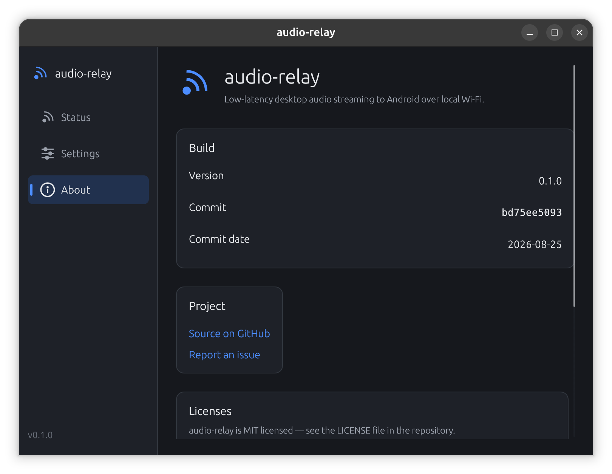

# User guide

How to install, pair, and use audio-relay — the desktop-app ↔ android-app
pair together. For build/dev instructions see the root
[`README.md`](../README.md); for design rationale see
[`architecture.md`](architecture.md).

## What you need

- A Windows or Linux laptop, and an Android phone, **on the same
  network** (same Wi-Fi, or the phone's own hotspot with the laptop
  connected to it).
- A Bluetooth speaker or earbuds already paired to your **phone** — the
  laptop just needs to be relaying to the phone; the phone routes it
  onward using its normal Bluetooth connection.

## Install

**Desktop:**

| Platform | Get |
|---|---|
| Windows | `audio-relay-<version>-windows-x86_64.zip` from [Releases](https://github.com/JeelGajera/audio-relay/releases) — unzip, run the `.exe`. No installer, no admin rights. |
| Linux (Debian/Ubuntu) | `audio-relay-<version>-linux-x86_64.deb` — `sudo apt install ./audio-relay-*.deb`, then run `audio-relay`. |
| Linux (other) | `audio-relay-<version>-linux-x86_64.tar.gz` — unpack, run the `audio-relay` binary. Needs PulseAudio or PipeWire's `pipewire-pulse` layer, standard on any desktop distro with audio. |

**Android:** install `audio-relay-<version>.apk` directly (Settings → allow
installs from this source if prompted). It starts its foreground service
immediately on first launch — no separate "Start" step.

## First-time pairing

1. Open the desktop app. It shows a 6-digit pairing code.

   

2. Open audio-relay on your phone. It lists laptops it finds on the
   network running the desktop app.

   

3. Tap your laptop, then type the code shown on the laptop's screen into
   the prompt that appears.
4. Once paired, the laptop shows "Streaming" and the phone shows the same
   — audio playing on the laptop now reaches whatever Bluetooth device is
   connected to your phone.

Both sides remember each other after this — normal daily use is just
"open both apps," no code re-entry.

## Home screen

**Desktop** — status (waiting to pair / streaming / disconnected), a
live output-level meter while streaming, and a **Relay audio** switch that
pauses sending without dropping the connection or forgetting the phone
(handy for muting the phone quickly without a full disconnect/reconnect).


**Android** — a **Relay** switch right on the Home screen turns the whole
feature on/off (this fully stops the foreground service; turning it back
on relaunches it). Below that: connection status, nearby laptops, and a
live playback-level visualiser while streaming.

## Settings

**Desktop:**


- **Capture device** — which output device's audio gets relayed. Leave
  it on the system default, or pick a specific one (e.g. if you have
  multiple sound cards). Falls back to the default automatically if the
  selected device disappears (e.g. you disconnect the Bluetooth speaker
  you'd selected).
- **Latency mode** — Low (~5ms capture chunks) vs Balanced (~10ms).
  Applies live, no restart.
- **Also play locally while relaying** — on by default, so this laptop
  keeps playing out loud exactly as it always did. Turn it off to mute
  this laptop's own output while streaming, so only the phone plays it.
- **Paired devices** — see and forget previously-paired phones.

**Android:**


- **Output device** — Automatic (Android's normal routing — whatever
  Bluetooth/wired/USB device is active), or pick a specific one.
- **Buffer size** — smaller means less delay, larger rides out a busy
  network. Applies on the next connection.
- **Appearance** — System/Light/Dark, and whether to take colours from
  your wallpaper (Material You).
- **Paired laptops** — see and forget previously-paired laptops.

## Listening on two headsets at once

Because **Also play locally while relaying** is on by default, the laptop
keeps playing to whatever it is connected to while it relays. So if you
have Bluetooth headphones paired to the laptop *and* another pair paired to
the phone, both hear the same audio — two people, two headsets, one source,
with no cable and nothing else to set up.

Two things worth knowing:

- The two headsets are **not perfectly in sync**. The laptop's own pair is
  roughly 150ms behind live (that is Bluetooth itself); the phone's pair is
  roughly 300ms behind, since it also crosses the network and the jitter
  buffer. Each listener only hears their own headset, so for music this is
  invisible — but if you are both watching the same screen, the phone side
  will trail the picture slightly. Lowering **Buffer size** on the phone
  narrows the gap.
- If you would rather *only* the phone play — handing your headphones to
  someone else, say — turn **Also play locally while relaying** off in the
  desktop app's Settings, and the laptop goes silent while streaming.

## About

Version, build commit/date, a link to the source, and this project's
licenses (both apps list their direct dependencies, grouped by license).

| | |
|---|---|
|  |  |
| Desktop | Android |

## Troubleshooting

**Phone doesn't find the laptop.** Confirm both are on the same network
— mDNS (how discovery works) doesn't cross subnets or most guest
Wi-Fi/client-isolation networks. A phone-hosted hotspot with the laptop
connected to it works; a public/guest network usually doesn't.

**Laptop shows "Disconnected" and never recovers.** It shouldn't need a
restart — the phone retries on its own if it still remembers this laptop.
If you forgot this laptop on the phone (or you're pairing a different
phone), the laptop always shows a fresh pairing code once it's not
actively streaming; just pair again with that code.

**Audio choppy or laggy.** The buffer grows on its own when the network
needs it, so **Buffer size** is a floor rather than a fixed value — raise
it if you want the app to start deeper, lower it if you want to prioritise
latency. Low latency mode on the desktop side shortens capture chunks
further.

If you want to see what is actually happening rather than guess, the phone
logs a health line every ten seconds:

```bash
adb logcat -s AudioRelay
```

```
depth=104/104 (+400ms adaptive) concealed=2.5% (944/38046) late=851 resyncs=0 trims=0 refills=80 drift=173ppm
```

- **`concealed`** is the share of audio replaced by silence — this is what
  choppiness sounds like. It is a lifetime average, so check whether it is
  still *rising* before worrying about the number itself.
- **`late`** counts packets that arrived after their turn to play. If this
  keeps climbing, the network's delay variance is larger than the buffer,
  and the adaptive depth should be growing to match.
- **`depth`** against its target tells you whether the buffer is actually
  holding what it is aiming for.
- **`resyncs`/`refills`** are recoveries; occasional ones are normal, a
  steadily climbing count is not.

**Notification permission prompt on Android.** Android 13+ asks for
notification permission on first launch so the "relay is running"
notification is visible; declining doesn't stop the app from working, the
notification (and its Stop button) just won't show.

**Nothing plays even though it says "Streaming."** Check your phone's
actual audio output — if no Bluetooth device is connected, audio plays
from the phone speaker by default (or wherever Settings → Output device
is pointed).
